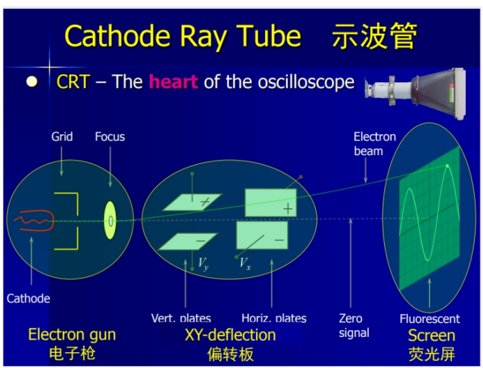
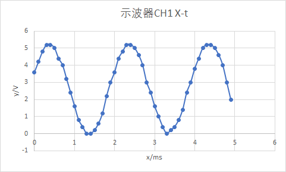
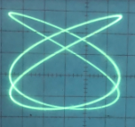

# 2020年秋季大学物理实验（1）-示波器使用

#### 专业班级：电气1908    学号：U201912072  姓名：柯依娃 日期： 2020/9/14  实验台：18号 报告柜：J21

### 实验名称：

示波器使用

### 实验目的：

玩转示波器，顺带学会使用信号发生器

### 实验仪器材料：

示波器，信号发生器，未知信号发生器，220V交流电源

 实验方案（装置）设计：相关理论（公式）、原理图、思路等

#### 示波器原理：

示波器原理：示波器利用狭窄的、由高速电子组成的电子束，打在涂有[荧光](https://baike.baidu.com/item/荧光/2942797)物质的屏面上，就可产生细小的光点（这是传统的模拟示波器的工作原理）。

#### 李萨如图形原理：

若两个正弦波同时发生，频率相同，构成椭圆
$$
x=Acos wt\\
y=Bsin(nwt+\phi)\\
若n为有理数\\
会形成封闭曲面\\
当x,y存在相位差\phi时，可以视作将坐标系转过一定角度，所以无影响封闭曲面的性质\\
$$

### 数据分析处理：

### 实验一：Y-t Mode

#### 原始照片：

#### 原始数据：

| x/小格 | 0    | 1    | 2    | 3    | 4    | 5    | 6    | 7    | 8    | 9    |
| ------ | ---- | ---- | ---- | ---- | ---- | ---- | ---- | ---- | ---- | ---- |
| y/小格 | 3    | 6    | 9    | 11   | 11   | 10   | 7    | 5    | 1    | -3   |
| x/小格 | 10   | 11   | 12   | 13   | 14   | 15   | 16   | 17   | 18   | 19   |
| y/小格 | -7   | -11  | -13  | -15  | -15  | -14  | -12  | -9   | -4   | 0    |
| x/小格 | 20   | 21   | 22   | 23   | 24   | 25   | 26   | 27   | 28   | 29   |
| y/小格 | 3    | 7    | 9    | 11   | 11   | 10   | 8    | 5    | 0    | -3   |
| x/小格 | 30   | 31   | 32   | 33   | 34   | 35   | 36   | 37   | 38   | 39   |
| y/小格 | -7   | -10  | -13  | -15  | -14  | -13  | -11  | -8   | -3   | 0    |
| x/小格 | 40   | 41   | 42   | 43   | 44   | 45   | 46   | 47   | 48   | 49   |
| y/小格 | 4    | 7    | 10   | 11   | 11   | 10   | 8    | 5    | 0    | -5   |

峰峰值横向格数：20

峰峰值纵向格数：11

#### 数据处理：

进行操作：
$$
x=X*0.5/5\\
y=(Y+15)*1/5
$$
得到数据：

| x/ms | 0    | 0.1  | 0.2  | 0.3  | 0.4  | 0.5  | 0.6  | 0.7  | 0.8  | 0.9  |
| ---- | ---- | ---- | ---- | ---- | ---- | ---- | ---- | ---- | ---- | ---- |
| y/V  | 3.6  | 4.2  | 4.8  | 5.2  | 5.2  | 5    | 4.4  | 4    | 3.2  | 2.4  |
| x/ms | 1    | 1.1  | 1.2  | 1.3  | 1.4  | 1.5  | 1.6  | 1.7  | 1.8  | 1.9  |
| y/V  | 1.6  | 0.8  | 0.4  | 0    | 0    | 0.2  | 0.6  | 1.2  | 2.2  | 3    |
| x/ms | 2    | 2.1  | 2.2  | 2.3  | 2.4  | 2.5  | 2.6  | 2.7  | 2.8  | 2.9  |
| y/V  | 3.6  | 4.4  | 4.8  | 5.2  | 5.2  | 5    | 4.6  | 4    | 3    | 2.4  |
| x/ms | 3    | 3.1  | 3.2  | 3.3  | 3.4  | 3.5  | 3.6  | 3.7  | 3.8  | 3.9  |
| y/V  | 1.6  | 1    | 0.4  | 0    | 0.2  | 0.4  | 0.8  | 1.4  | 2.4  | 3    |
| x/ms | 4    | 4.1  | 4.2  | 4.3  | 4.4  | 4.5  | 4.6  | 4.7  | 4.8  | 4.9  |
| y/V  | 3.8  | 4.4  | 5    | 5.2  | 5.2  | 5    | 4.6  | 4    | 3    | 2    |

 峰峰值/s：2

峰峰值/V：5.2

画出图形：

| 信号发生器      |              | 示波器                |         |                         |         |           |         |
| --------------- | ------------ | --------------------- | ------- | ----------------------- | ------- | --------- | ------- |
| 读数            |              | 读数                  |         |                         |         |           |         |
| Frequency f(Hz) | 幅度Vpp（V） | VOLTS /DIV Dy(V /cm ) | Y（cm） | TIME/DIV    Dx（ms/cm） | X（cm） | Up-p（V） | T（ms） |
| 500             | 5            | 1                     | 26      | 0.5                     | 2       | 5.2       | 2       |

$$
Er(U)=\frac{|Upp-Vpp|}{Vpp}*100\%\\
Er(T)=\frac{|T-\frac{1}{f}|}{\frac{1}{f}}*100\%
$$

代入数据有
$$
Upp=5(1\pm\frac{1}{25})V\\
T=0.2ms
$$

## 实验二:李萨如图形测未知信号

|          |  |  |  |  |
| -------- | ------------------------------------------------------------ | ------------------------------------------------------------ | ------------------------------------------------------------ | ------------------------------------------------------------ |
| fx（Hz） | 99.497                                                       | 199.001                                                      | 49.750                                                       | 149.270                                                      |
| fy（Hz） | 99.497                                                       | 99.501                                                       | 99.500                                                       | 99.513                                                       |

fy平均值为99.503Hz

## 实验三：利用X-Y模拟Y-t测未知频率

| 周期数N      | 1                                                            | 2                                                            | 3                                                            |
| ------------ | ------------------------------------------------------------ | ------------------------------------------------------------ | ------------------------------------------------------------ |
| 图片         |  |  |  |
| fx（Hz）/CH1 | 99.503                                                       | 49.752                                                       | 33.167                                                       |
| fy（Hz）/CH2 | 99.503                                                       | 99.504                                                       | 99.501                                                       |

fy平均值为99.503Hz

### 实验小结：

本次实验熟悉了示波器的操作，学习其中的原理，同时熟练使用它

### 关于使用Markdown or Latex提交报告的建议：

- 排版与美观：纸质版报告首先排版困难，难以修改，图片以粘贴形式pin上去本身加大了学生的工作量，同时同学的字好看与否差异较大，遇上像我一样字写的极丑我自己都不想再看的也增加了老师的工作量
- 知识学习：在本科阶段，通过物理实验提前让学生学习markdown or latex的使用方法，可以让同学们拥有一个高效的适合自己的工具，了解这方面的知识，向matlab，simulink，python等等软件进行学习进行一个技术革命，而纸质版报告本身处于一个正在被淘汰的状态，国家政策在社会民生方面已经引进了无纸化的一个政策，华科作为国家的一个技术先进的地方，居然还在使用纸质版报告，这个本身就很奇特

### 关于使用数字示波器的建议：

- 模拟示波器本身操作上与数字示波器相差不大，只是功能少了一些无法和电脑进行耦合而已，作为单纯领进门的教学用具，如果学校科研经费不够的话，是完全可以应付的。但是，考虑到后续同学们使用基本上都在用数字示波器，以及我所看到的学校西二楼里摆着的无数闲置的数字示波器，让我觉得学校其实并不缺少购置示波器的经费，那么在这种情况下选择技术革新直接使用数字示波器教学，可以教授更多使用技巧，加深对于示波器的使用，提高学生能力

