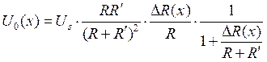
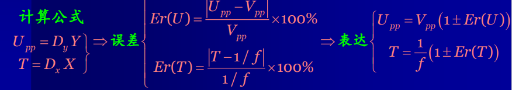
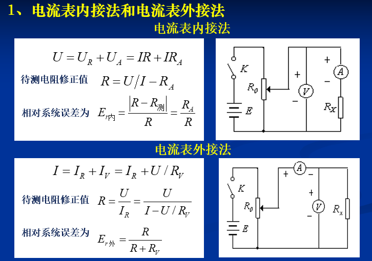

# 物理实验复习总览

注意不会复习分光计,因为我没做2333

# 仪器使用和原理分析

##  示波器

李萨如图形

电压峰峰值测量:谷点与水平线相切，峰巅正交垂直刻度线

周期测量:谷底之间距离

# 直流电桥-

- 是一种精密的电阻测量仪器,有平衡电桥和非平衡电桥,平衡电桥是调节电桥平衡得到测量电阻,而非平衡电桥是通过测量电桥输出计算得到待测电阻
- 平衡电桥只能用于测量具有相对稳定状态的物理量，而在实际工程和科学实验中，很多物理量是连续变化的，只能采用非平衡电桥才能测量。

1. 直流单臂电桥
   1. 
   2. 
2. 非平衡电桥       
   1. 
   2. ​        分为三类
      1. 等臂电桥
         - 等臂电桥：；
      2. 输出对称电桥(卧式电桥)
         - 输出对称电桥（卧式电桥）：，，且
      3. 电源对称电桥(立式电桥)
         - 电源对称电桥（立式电桥）：，，且。
   3. 预调平衡
      1. 初始状态下U0=0
      2.   
      3. 满足此条件时预调平衡
   4. 
      1. 由于R4因为某非电量x变化而变化为,电桥电压输出产生为
      2. 又因为满足预调平衡
   5. 化简约分,当$\Delta R<<(R_1+R_2)$,约去分母中的ΔR
      1. 等臂电桥:
      2. 卧式电桥
      3. 立式电桥
      4. 等臂电桥、卧式电桥输出电压比立式电桥高，因此灵敏度也高，但立式电桥测量范围大，可以通过选择、来扩大测量范围，、差距愈大，测量范围也愈大。
   6. 当不满足$\Delta R<<(R_1+R_2)$时
      1. 等臂电桥
      2. 卧式电桥
      3. 立式电桥

这是一种线性电阻，具有正的温度系数，为时的阻值，为温度系数，其理论值。

## 伏安特性

电流表内接外接

九孔板

精度等级 含百分号

记得接限流电阻,注意电压表电流表量程选择

## 密立根油滴实验

## 超声声速测量

压电换能器的工作原理-驻波波节处压强最大

压电材料在电场 E 的作用下产生伸 缩形变 S，且满足 S  d  E （d 为伸缩常数），在交变电场的作用下会产生周期性的收缩和伸长，当 外加电场的频率和压电体固有频率相同时振幅最大。故寻找固有频率

当激励正弦电信号与换能器固有频率基本一致时能较为有效地实现电能和声能的相互转换

### 共振干涉法

共振波节

### 相位比较法

why?难道它不反射吗

### 时差法

脉冲就行

# 数据处理误差分析

## 示波器

### 实验一-测量峰峰值和周期和之的相对误差

### 实验二-李萨如图形测量频率

### 实验三-锯齿波仿扫描测量频率

## 直流电桥

### 实验一 平衡电桥求$\alpha$ ,求相对误差

$R_x=R_4=\frac{R_1}{R_2}R_3$

画图

最小二乘法

### 实验二 卧式电桥求$\alpha$ ,求相对误差

预调平衡,R0=R1

画图计算得到$\alpha$

平衡电桥电阻调节精度更高，可达0.1%，而非平衡电阻记录的U的精度很低，同时电阻调节可以调成刚好在-0.0到+0.0之间会更合适

### 实验三 立式电桥测量温度特性

作MF51型热敏电阻的R(T)～T和 lnR(T)～1/T曲线，并用最小二乘法求出材料常数Bn和R25，写出经验方程。

## 伏安特性

精度等级带来的误差: 量程*精度等级%

计数时记录带估读的格数

做伏安特性曲线即可

## 密立根油滴实验

不用记吧应该

## 声速测量

理想声速

1、用逐差法处理数据，按（3.12-11）式计算声速。记录测量时的室温t ，由（3.12-9）式或（3.12-10） 式计算该温度时空气中的声速，与实验中测得的空气中的声速比较，计算 v  v理－v实 及 ％ － 理 理 实 100 v v v 。 2、用逐差法处理数据，按（3.12-12）式计算水中的声速v ，评估其不确定度并给出完整的结果 表述。

逐差法处理数据

### 普朗克常数的测量

### 波长频率

## 霍尔效应

对称测量法抵消系统误差

