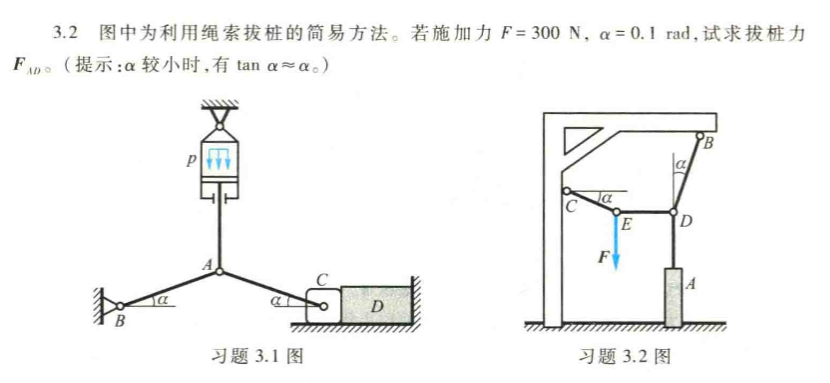
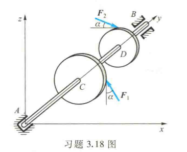
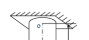

[TOC]

# Mechanic Engineer Homework and Tips

### 刚体静力学基本概念与理论(2.6eg 2.7cd 2.9ab 2.10ac)

#### 2.6 2.7 画受力图（注意不要把约束放进去，每次只画受力物体，别忘记部分力矩，好好使用二力杆，三力交一线等方式，我个人习惯设置拉力为正方向）

#### 2.9 2.10 求主矢和主矩（分布和离散的都要会求，本质上求主矢就是所有力的直接合成，主矩是算出所有转矩叠加，如果问力作用位置就看主矩再除以主矢量，请注意是针对哪个点的主矩）

**ALL right** 

### 静力平衡问题（3.2 3.3 3.5 3.9 3.17b 3.18 3.19c 3.20）

#### 3.2 绳子牵引刚体求平衡力(对关键节点受力分析)

#### 3.3 3.5 3.9 对杠的平面受力与力矩分析进而求得约束力(力,力矩,注意别忘记把符号变成数字)

##### **forget to make 3.3 calculate complete to numbers,else are right**

#### 3.17对桁架的平面受力与力矩分析进而求得各内力(截面法，注意机智的取力矩分析点)

##### **3.17 桁架题 F2 求错，因为忘记了F5也会有力矩，所以在这里把求力矩的参考点放在C点会更好，其它都对** 

#### 3.18 对传动轴的空间受力与力矩分析进而求得约束力(力3,力矩3，解方程，画投影坐标系)（考虑把每个力的大小和矢量表达清楚然后用矢量写法，更好）

**ALL right**

#### 3.19 3.20 求重心（老一套了，注意负密度和不同的密度就行）

##### **3.19读错题了，他们密度不一样，3.20忘记化简了，其它都对**

### 变形体静力学基础(4.1g 4.2a 8.1c 9.1fhj 9.2acg 4.4 4.6 4.8 4.9 4.10)

#### 4.1 用截面法求内力（往往不是单纯的杆子）（先算外力再算内力）(算内力的时候一定要注意方向，一般右截面上顺右为正，左截面下逆左为正)

##### **the answer is right but in the 截面 we should notice the Force’s direction. For example, at 2, we should use different location!**

#### 4.2 8.1c 9.1fhj 9.2acg 画出轴力图扭矩图剪力图与弯矩图（先受力分析算外力再通过截面法或者快速画法算内力（最好都用））（一定要注意方向，一般轴力图左（对右为拉）为正，扭矩图M方向（向左为正）（对右半部分就能有向右旋转的角度），剪力图向上为正，弯矩图垂直纸面向内为正）（以及注意不要在图上写-5N for example，use 负号 in pic and 5N）

##### **反了，官方是向左为正，因为这样对右部分就是拉了**

##### **9.1 h wrong, 因为忘记了方向搞错了，而且明显的积分就错了（不知道写的时候自己是怎么想的）总之一定要仔细看方向**

**All right**

#### 4.4 4.6  在求得轴力图的基础上求内力，从而除以截面积得到应力，进而求得应变（注意拉压）（注意只用画轴力图，没有应力图这种东西）

##### **4.4 没有应力图，直接根据轴力图分段列公式求应力即可**

**ALL right**

#### 4.8 4.9 4.10 变形体静不定问题中的拉压部分，受限于几何关系而确定最终应变分布(先确定静力方程，再依次列写力和应力的关系，应力和应变的关系，应变和宏观几何的关系，宏观几何的约束关系，联立以上方程可以解出力，然后再根据题目要求求出应变等，别忘了)

##### **4.9忘记求应力了，4.10除法忘记了cm^2 对应10^-4, 做成了10^-3，故少了10倍，要小心**

### 材料的力学性能（thinking5.1 5.2 exercise 5.1）

#### 5.1 5.2 理论知识，尤其需要记住应力-应变曲线！

最开始是一段线性弹性形变，然后进入屈服阶段，这个时候快速形变（含塑性形变），然后进入强化阶段，最后颈缩阶段

线性弹性形变E….

E，σmax…..

#### 5.1 通过实验计算弹性模量E和泊松比μ（记住泊松比的算法）

**ALL right**

### 强度与连接件设计(6.1 6.2 6.4(2) 8.3 8.4 8.8 8.11(1) 6.10)

#### 6. 1 6.2 6.4 本质上都是拉压状态下静定or静不定+变形体问题，只是根据【σ】条件来进行设计计算，注意【σt】是拉，【σe】是压

**ALL right**

#### 8.3 8.4 8.8 是扭转状态下的几何计算，注意【θ】是单位扭转角，本质上就用了τ=Gγ=My/Iz,dφ/dx=M/GIz,γ=y * dφ/dx,圆柱$\frac{\pi d^4}{32}$

##### **G 10^9 M 10^6 搞错了最开始**

##### **搞错了【θ】刚度的含义，实际上是单位扭转角，其它正确**

#### 6.10 强度与连接件设计综合，考虑拉、剪切、挤压后得到结果，实际与之前完全一致，每个物体都要受力分析，注意剪切截面等等事项

**ALL right**

### 梁的平面弯曲（ 9.4 9.5 9.8 9.10）

#### 9.4 重心的计算方法和Iz的求法(平行轴定理和矩形的$\frac{bh^3}{12}$及圆形的$\frac{\pi d^4}{64}$(可以从扭转除以2得来因为垂直轴定理))以及$\sigma=\frac{My}{I_z}$，要学会怎么看拉压方向噢

##### **拉压方向错，其它对**

#### 9.5 最大弯曲正应力σ=M/Iz*ymax, 一定不要想当然力的分布就是说，然后要注意不同形状求Iz时要确定积分方式，别从负积到正忘记了函数形式本身的改变，然后时刻注意用平行轴定理等辅助

totally wrong!!!!!!!!!!

##### to find the max sigma, we should use M/Iz first and find the max y

##### **我忘记了公式表达change了部分，so上下要分开算，像这种对称的x2最好啦**

#### 9.8 计算弯矩产生的最大sigma后分析强度刚度等约束,通过轴力图弯矩图找到最大弯矩并计算出其最大σ判断是否满足对应条件即可

**ALL right**

### 应力状态（10.1（cd）10.2（bd）10.7 10.9）

#### 10.1cd 对寻常物体进行受力分析，进而画出各点的应力状态，在边缘的点没有剪应力，在中间轴的点不受拉压，先用截面法想清楚就好

##### **我最开始不知道怎么做，看了答案才会的，发现就是在边缘的点就没有剪应力的作用了，只有拉压，同理，在中间轴上的没有拉压只有剪应力等**

#### 10.2 求主应力和主平面，求最大切应力和切平面，请记住**$\sigma_n=\frac{\sigma_x+\sigma_y}{2}+\frac{\sigma_x-\sigma_y}{2}cos2\alpha-\tau_{xy}sin2\alpha$,$\tau_n=\frac{\sigma_x-\sigma_y}{2}sin2\alpha+\tau_{xy}cos2\alpha$,**可以想像，α=0时σn=σx，τn=τxy，当α=90时，σn=σy，τn=-τxy，保证公式别记错，考试前再背一遍！（当然也可以自己推一遍）

##### **可以有两选择，第一自己完全证明出来，第二背部分公式然后做，根据我的写法我认为用第二种再用第一种检查是个好选择**

#### 10.7 10.9 联系所有得到内力分布，通过各种强度理论或题目要求校验强度和刚度,注意第一强度理论$\sigma_1$，第二强度理论ε:（$\sigma_1-\mu(\sigma_2+\sigma_3)$）,第三强度理论τ：$\sigma_1-\sigma_3=\sqrt{\sigma^2+4\tau^2}$ ,第四强度理论vd：$MSE\ of\ sigma$ (only 拉和剪切：$\sqrt{\sigma^2+3\tau^2}$)

第四强度理论$\sqrt{\sigma^2+3\tau^2}$ 如果只受拉和剪切（我不知道为啥…）

##### **我本来不知道怎么做直到看到了答案，实际上要先分析清楚哪里力最大，F1给了整体一个拉力，大家受力都一样，F2给了一个剪切力，这个时候离F2越远弯力矩越大，越外面越大（圆柱的外围一圈），其中左边受拉右边受压，而M给了一个扭转力，越靠外面越大，故总而言之 的上端最左边受拉力最大，还受剪切力τ，然后根据第四强度理论$\sqrt{\sigma^2+3\tau^2}$ 得到相关强度条件（实话说我也不知道为什么可以这样)，总而言之这题需要先感性思考一下哪里应该最容易断再继续想，可以合适的使用叠加定理去思考** 

**it's right though**

## 工程力学指导

