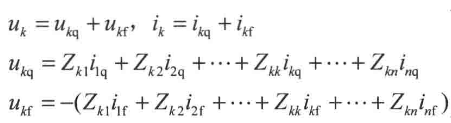

# 线路与绕组中的波过程

波沿均匀无损单导线的传播，波阻抗$Z=\sqrt\frac{L}{C}$，波速$v=\frac{1}{\sqrt{LC}}$。从功率的观念看，波阻抗与一数值相等的**集中参数电阻**相当，但是不消耗能量，反映单位时间内导线获得电磁能量的大小。波动方程的解有正行电压和反行电压，可以视为正电荷给电容充电，正电荷正行和负行，则正行电流为正，负行电流为负。故$\frac{u_q}{i_1}=Z,\frac{u_f}{i_f}=-Z$。对接地电缆来说，电感小，电容大，波速约为光速的2/3,波阻抗不大于100欧姆。对单导线架空线路，Z=500欧，对分裂导线架空线路，Z=300欧。

波的折射与反射，重点公式$u_{2q}=\frac{2Z_2}{Z_1+Z_2}u_{1q}=\alpha u_{1q},u_{1f}=\frac{Z_2-Z_1}{Z_1+Z_2}u_{1q}=\beta u_{1q}$ 一定要注意其与碰撞公式有区别，记住结论开路两倍电压，短路两倍电流，基本上就OK啦。对接电源的地方，其能保持接触位置始终为对应电压值，如果遇到波就会完全反向反射回去。对预先充电的电揽，如开路，有电压为U电流为0，则为U/2的两个正向电压波和反向电压波的叠加，注意其有尽头。彼得逊法则为等值集中参数定理，可以将电缆转换为集中参数，**2**倍电压或**2**倍电流，只可以适用于线路末端反射波未到节点处的分析， 可以方便的算出节点电压。

波通过串联电感和并联电容时，对节点分析可使用彼得逊法则，通过彼得逊法则可以推导得串电感最大电流陡度为$\frac{2U_0}{L}$ 故负载最大电压陡度为$\frac{2U_0}{L}Z$ 并电容最大电压陡度为$\frac{2i_0}{C}$ 其中由戴维南等效得$2i_0=\frac{2u_0}{Z_1}$ 则并电容最大电压陡度为$\frac{2U_0}{Z_1C}$ 。串电感并电容不会影响稳态，只是减缓了暂态。可以通过其减缓过电压陡度，进行对应保护。 

波的多次折反射，网格法。网格法用折线表示电压的传播，用纵向表示时间状态，从而易于计算。对有中间线段的传输线来说，如果中间线段波阻抗小于两边波阻抗，相当于中间并电容减小了电压陡度，而如果中间线段波阻抗大于两边波阻抗，相当于中间串电感减小了电压陡度，如果中间线段波阻抗位于两边波阻抗中间，会形成电压震荡。

贝杰龙法利用了u+iZ是正行波，u-iZ是反行波去进行相应集中参数求解，计算机用的多。

平行多导线系统中的波过程，需要考虑导线间的电磁耦合，则 记住该公式就是整个原理。对电缆芯线和电缆屏蔽层的耦合关系考虑，由于屏蔽层i2产生的全部磁通与电缆芯线相交链，当电流在电缆屏蔽层上流动时，芯线上会感应出于屏蔽层电压相等但方向相反的电动势阻止电流流进芯线。而靠近的两导线，其一受雷击，另外一个也会感应出电势，距离越近电势越近。需要会算**互波阻抗和自波阻抗 书第6题**。  $Z_{km}=\frac{1}{2\pi\epsilon_0}\ln \frac{D_{km}}{d_{km}}/v=\frac{1}{2\pi}\sqrt{\frac{\mu_0}{\epsilon_0}}\ln \frac{D_{km}}{d_{km}}$ 自波$Z_{kk}=\frac{1}{2\pi\epsilon_0}\ln \frac{2h_{k}}{r_{k}}/v=\frac{1}{2\pi}\sqrt{\frac{\mu_0}{\epsilon_0}}\ln \frac{2h_{k}}{r_{k}}$  dkm为两导线距离，Dkm为导线m的镜像和导线k的距离。hk为导线k与地的距离，rk为导线k的半径。

波的衰减和变形，线路如果有电阻电导，则会有损耗有衰减。如果波磁能和电能之比等于电流波热损耗和电压波热损耗之比，则无畸变$\frac{\frac{1}{2}L_0i^2}{\frac{1}{2}C_0u^2}=\frac{R_0i^2t}{G_0u^2t}$ 则$\frac{L_0}{C_0}=\frac{R_0}{G_0}$。实际中R0影响更大。冲击电压会产生电晕，由第一章得知正极性雷电电晕更大，电晕会使得电容增大，即波阻抗降低波速降低，会增大导线间的耦合系数，会减小波陡度降低波幅值，故发变电设置进线端保护是通过电晕来限制波陡度。

变压器绕组中的波过程，实话说没看懂其推导，记一些结论。单相变压器绕组开路或短路的电位分布为$u=U_0e^{-\alpha l \frac{x}{l}}$ 其中$\alpha l =\sqrt\frac{C_0l}{K_0/l}$ C0是分布对地电容，K0是匝间电容。注意其图像。最大电位梯度为$-\alpha l U_0/l=-\alpha U_0$ 。绕组各点在振荡过程中能达到的最大电位$U_{max}=2u_\infty -u_0$ 如果绕组末端接地，最大电位约发生在绕组1/3处，为1.4U0，如开路，则在末尾，约为2U0。如果变压器前有避雷器，产生接波，会有振荡，有更高的电位梯度容易击穿匝间绝缘。非共振变压器**补偿对地电容C0，增大纵向电容K0** 从而减少$\alpha l$。 对三相绕组中的波过程，可以通过彼得逊法则和振荡最大值去思考中点电位，如单相注入，稳态1/3U0，最大值是2/3U0，两相注入稳态2/3U0，最大值4/3U0，三相注入稳态U0，最大值2U0。三角形接法则类似，单相注入分布，两相叠加注入分布和三相分布。注意绕组间的静电感应和电磁感应。

旋转电机绕组中的波过程与变压器分析相似，忽略K0的作用，槽内C0大波阻抗波速小，且C0随进槽出槽变化，使得波阻抗和波速变化。而需要会算由于匝间绝缘的限制，陡度最大为$a_{max}=\frac{vU_j}{l_z}$。

