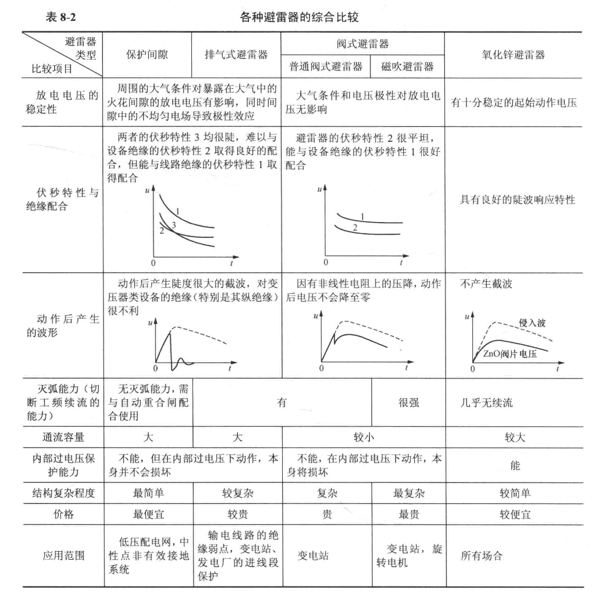

# 雷电及防雷保护装置

雷云放电及雷电过电压，雷云1 ~ 5km为负电荷雷云，5 ~ 10km为正电荷雷云，负电荷雷云在地上感应出正电荷，之间场强大，雷云先导放电，地面发出迎面先导，碰撞后产生主放电。之后其电导较高，易于二次放电。雷电等效为电流源等值电路，习惯上把流经波阻抗为0的被击物体的电流称为雷电流，为沿Z0传来的电流**两倍**。

雷电参数及雷电活动特性有一些可能需要记的经验公式，我国现行标准推荐雷电流幅值分布概率$\lg P =\frac{-I}{88}$ P为雷电流幅值大于或等于I的概率。对雷暴日小于20的地区，$\lg P =\frac{-I}{44}$ 。而线路防雷保护计算中雷电流波头波尾时间**2.6us/50us**，用斜角平顶波/三角波表示，注意和标准雷电波**1.2us/50us**区分开。波头陡度为$a=\frac{I}{2.6}(kA/\mu s)$ 而特高压防雷设计时用半余弦波表示波头，$i=\frac{I}{2}(1-\cos wt)$ 雷暴日是一年有雷电的天数，雷暴小时是一年有雷暴的小时数。地面落雷密度用$\gamma$ 表示，$\gamma=0.07(次/km^2·雷暴日)$ 线路遭雷击的次数$N_L=\frac{N_g(28h_r^{0.6}+b)}{10}[次/100km ·a]$ $N_g=T\gamma,h_r杆塔高度，b为避雷线距离$ 

避雷针和避雷器有保护范围，计算方法有折线法和滚球法，需记这两公式。折线法$r_x=(h-h_x)p,(h_x\ge \frac{h}{2});r_x=(1.5h-2h_x)p,(h_x< \frac{h}{2})$  $h\le 30m,p=1;30m<h\le 120m,p=\frac{5.5}{\sqrt h},h>120m,p=0.5 $ 记一半到0.5hp，全部到1.5hp比较好记，折线。对两支等高避雷针的联合保护，中间落处$h_0=h-\frac{D}{7p}$ D为两针间距离。对不等高避雷针，要进行假想等高避雷线进行处理。对滚球法，有击距的概念$h_r=10I^{0.65}$ I为雷电流幅值（kA）。滚球法相当于半径为hr的球沿着避雷线滚，碰不到的地方就是能被保护的地方。而**避雷线**的保护范围$r_x=0.47(h-h_x)p,(h_x\ge \frac{h}{2});r_x=(h-1.54h_x)p,(h_x< \frac{h}{2})$  $h\le 30m,p=1;30m<h\le 120m,p=\frac{5.5}{\sqrt h},h>120m,p=0.5 $ 两避雷线中最低点O高度$h_0=h-\frac{D}{4p}$。概念：保护角，避雷线与所保护的外侧导线之间的连线与经过避雷线铅垂线之间的夹角。角越小越好，日本有负保护角。

避雷器就看一张表就完了。

接地技术与接地装置，电力系统接地有工作接地（正常工作）、保护接地（保护人类）、防雷接地（泄放雷电）三种。允许最大接触电压和跨步电压分别为$U_{jmax}=\frac{0.116}{\sqrt t}(R_b+0.5R_f)V$ $U_{kmax}=\frac{0.116}{\sqrt t}(R_b+2R_f)V$ $R_b 身体电阻，R_f为一只脚与大地的过渡电阻，t是故障时间$ 。由于雷电高频特性，电感感抗大，即同一接地装置在冲击电流和工频电流下有不同的电阻值$\alpha =\frac{R_{ch}}{R}$ 。 单根垂直接地体电阻$R=\frac{\rho}{2\pi l}(\ln \frac{8l}{d}-1)$ ，n根并联 $R_{\sum}=\frac{R}{\eta n}$ η为接地体的利用系数。水平接地体接地电阻为$R=\frac{\rho}{2\pi L}(\ln \frac{L^2}{dh}+A)$ 。对土壤电阻率大的要铺设人工接地体。发电厂和变电站的接地电阻约为$R=\frac{0.5\rho}{\sqrt S}$ S是接地网的总面积。接地电阻应不大于4欧，RI小于120V。

